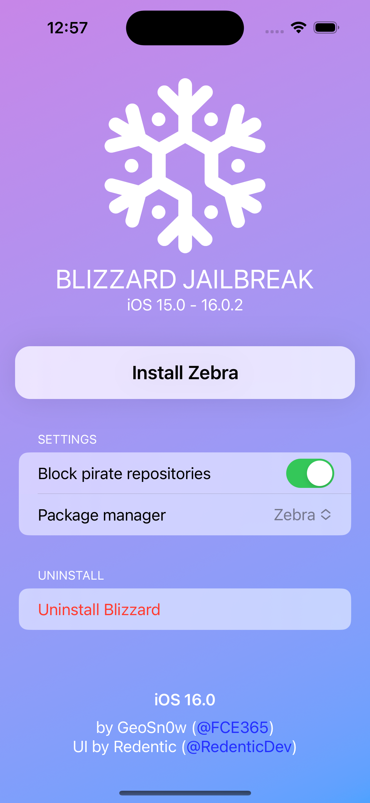

# Blizzard15UI

Working concept for [@GeoSn0w](https://github.com/GeoSn0w)'s Blizzard jailbreak (iOS 15+).

## Features
- Made in SwiftUI
- iOS-like design
- Native dark mode support
- iPad ready
- Use latest features for iOS 16 design

## Screenshots
Device | Screenshot
:---: | :---:
iPhone 14 Pro (iOS 16) | 
iPad Pro (iOS 16) | 
iPhone 13 Pro (iOS 15) (Dark mode) | 
iPhone 8 (iOS 16) (Dark mode) | 
**Video** | 

## Known issues
- The `List` used for the Settings and Uninstall buttons is scrollable on some models, even when it's not useful

## TODO
If this is actually used in the said jailbreak:
- Disable controls during the process
- Show ongoing process steps in button
- Add progress bar into the button during the process
- Add alert on success/failure of the process

## Can I use it/copy it in another project?
Not without my acknowledgment.
